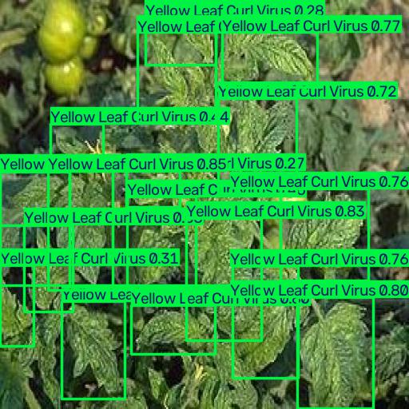

# PlantDiseaseAI — Reliability-Aware Plant Disease Recognition

**AquaFoodMind | Lebanon | Precision Agriculture & Crop Intelligence**

**Hackathon project:** *AI in Agriculture: Smart Aquaponics and Hydroponics — AI, IoT, and Data-Driven Monitoring for Sustainable Crop Production*

**Repository focus:** PlantDiseaseAI, the implemented AI plant-health screening and reliability-aware computer-vision component of the broader AquaFoodMind proposal.

**Hackathon proof of concept | Frozen model inference | Reproducible Jupyter demonstration**

PlantDiseaseAI is a research-oriented computer-vision prototype for plant disease recognition under agricultural domain shift. It combines a **13-class ConvNeXt-Tiny image classifier** with **independent YOLO11n tomato-leaf detection**, calibrated confidence and reliability-aware **ACCEPT / VERIFY** decisions, and optional Grad-CAM++ attention visualization.

The intended application is **human-assisted crop monitoring**, including tomato production in greenhouse and hydroponic settings. This repository demonstrates **image-based inference**, not a deployed IoT system, automated irrigation controller, autonomous plant diagnosis, or live greenhouse integration.

## 1. Problem and objective

Models evaluated on controlled leaf photographs may perform much worse on field-style images because of changes in lighting, backgrounds, camera conditions, leaf appearance, and disease presentation. High confidence alone is not sufficient evidence of a reliable prediction.

This proof of concept aims to:
- classify tomato and lettuce leaf images using a frozen vision model;
- expose confidence and a conservative **ACCEPT / VERIFY** reliability decision;
- detect and visualize tomato-leaf disease-related regions using a separate YOLO model;
- provide a small, reproducible demonstration with downloadable frozen weights and example outputs;
- support **human review**, especially when model evidence is uncertain.

## Intended user and business decision

The intended end users are **greenhouse growers, crop-monitoring technicians, and agricultural advisors** who currently rely on visual scouting and manual expert review. In a future supervised greenhouse workflow, a user could submit an RGB leaf photograph, review a disease-category prediction and independent bounding-box visualization, and decide **whether to inspect the plant more closely, request expert verification, or prioritize monitoring**. The current prototype does not prescribe treatments or control equipment.

The proposed value is **triage and documentation**, not a verified increase in yield, reduced pesticide use, or commercial return on investment. Satellite imagery is not the right input for the current leaf-level notebook because its demonstrated task uses close-up RGB photographs; future satellite or hyperspectral integration is outside the implemented scope.

## 2. What the repository actually implements

| Component | Implementation | Scope |
| --- | --- | --- |
| Image classification | ConvNeXt-Tiny | 13 classes: 10 tomato and 3 lettuce |
| Reliability decision | Crop-specific temperature scaling; confidence, prediction margin, and normalized entropy checks | ACCEPT or VERIFY; frozen thresholds |
| Tomato detection | YOLO11n | 9 tomato detection categories; bounding boxes |
| Visual explanation | Grad-CAM++ | Qualitative attention evidence, **not** lesion segmentation |
| Demo | Jupyter notebook | Single-image inference and saved outputs |
| Greenhouse context | Broader research/application motivation | **No live sensor connection or actuator control in this repository** |

**Important architectural distinction:** YOLO11n and ConvNeXt-Tiny run as **independent inference branches on the input image**. YOLO detections are not fed as crops to the classifier and do not override the classifier's ACCEPT / VERIFY decision. Their label spaces are different and should not be treated as interchangeable.

## 3. Repository contents

```text
PlantDiseaseAI-Hackathon/
├── README.md
├── requirements.txt
├── download_checkpoint.py
├── .gitignore
├── notebooks/
│   └── 01_plant_disease_demo.ipynb
├── deployment/
│   ├── __init__.py
│   ├── inference_engine_final_repair_v1.py
│   └── yolo_detector_final.py
├── data/
│   └── sample_input/
│       └── sample_leaf.jpg
├── outputs/
│   ├── final_repair_v1_calibration/
│   │   └── reliability_config.json
│   └── yolo_detection/
│       └── FINAL_YOLO_RELEASE/
│           └── yolo11n_detection_final.pt
└── results/
    ├── example_output.jpg
    ├── example_prediction.json
    └── YOLO_FINAL_METRICS.txt
```

The larger ConvNeXt-Tiny checkpoint is distributed through a **GitHub Release**, not tracked directly in Git.

## 4. Quick start

### Prerequisites

- Python **3.10** is recommended.
- An internet connection is needed once to install dependencies and download the ConvNeXt checkpoint.
- A CUDA-capable GPU can accelerate inference; hardware compatibility and CPU behavior depend on the installed PyTorch stack.
- Use a clean virtual or conda environment where possible.

### Clone the repository

```bash
git clone https://github.com/sarahassaad140/PlantDiseaseAI-Hackathon.git
cd PlantDiseaseAI-Hackathon
```

### Install dependencies

```bash
python -m pip install -r requirements.txt
```

The `requirements.txt` file pins the primary runtime packages. If your installation reports a missing `timm` or `pytorch_grad_cam` import, install the corresponding pinned packages and add them to `requirements.txt` before considering the environment independently reproducible:

```bash
python -m pip install timm==1.0.28 grad-cam==1.5.5
```

> **Reproducibility note:** The inference notebook was exercised in the project's existing `plant_ai` environment and its GitHub fresh clone. A completely independent clean-environment dependency installation has not been established here; therefore, cross-platform reproducibility is not guaranteed.

### Download and verify the frozen classifier checkpoint

```bash
python download_checkpoint.py
```

This downloads the checkpoint to:

```text
checkpoints/convnext_tiny_targeted_repair_v1/best_balanced_accuracy.pth
```

The downloader verifies the file using SHA-256 and safely reuses an already verified copy.

- Release: [v1.0.0-hackathon](https://github.com/sarahassaad140/PlantDiseaseAI-Hackathon/releases/tag/v1.0.0-hackathon)
- ConvNeXt-Tiny checkpoint SHA-256:
  `b4f1ecf003f7710de4454f33babe841da9a302436a74a8a1b19590a68b3ea602`
- YOLO11n checkpoint SHA-256:
  `4c5ea28cd7e175d0e110faedebcce2613959d415c92543772f1354edff99c4c5`

### Run the notebook

Launch Jupyter from the **repository root**:

```bash
jupyter notebook
```

Open:

```text
notebooks/01_plant_disease_demo.ipynb
```

Select a kernel using the environment where the dependencies are installed, then choose **Restart Kernel and Run All Cells**.

The notebook uses the included sample image and writes demonstration artifacts to `results/`. It should be run from the repository root so that relative paths resolve correctly. **No hardware-independent runtime estimate is claimed**; execution time depends on device, installed PyTorch stack, and first-time checkpoint download. No API key is required for the local sample demonstration.

## 5. Example input and output

**Input:** `data/sample_input/sample_leaf.jpg`

In the documented local demonstration, the classifier returned:

| Field | Example |
| --- | --- |
| Crop | Tomato |
| Predicted class | Tomato yellow leaf curl virus |
| Calibrated confidence | Approximately 0.7943 |
| Reliability decision | ACCEPT |
| YOLO detections | 18 boxes labeled Yellow Leaf Curl Virus |

Generated examples:
- [`results/example_prediction.json`](results/example_prediction.json) — machine-readable inference output
- [`results/example_output.jpg`](results/example_output.jpg) — annotated detection visualization



The 18 YOLO boxes may overlap substantially; they are **model-generated regions, not 18 independently confirmed lesions**. These results are **illustrative single-image outputs**, not evidence of generalization accuracy or agronomic confirmation. ACCEPT means the frozen reliability checks were passed; it does **not** mean a disease diagnosis is guaranteed to be correct.

## 6. Evaluation evidence and interpretation

### ConvNeXt-Tiny classification

The research development process included controlled-domain training, multi-domain learning, targeted class-level refinement, external auditing, and a separate field-style stress test.

| Evaluation setting | Accuracy | Notes |
| --- | ---: | --- |
| Historical multi-domain internal test | 98.09% | Internal benchmark; **not** real-world accuracy |
| Frozen tomato supplementary external audit | 71.20% | Balanced accuracy 68.54%; macro F1 67.60% |
| Held-out lettuce evaluation | 91.15% | Balanced accuracy 91.11%; macro F1 91.09% |
| Separate 70-image field-style stress test | 31.43% | 7 classes; substantial domain-shift limitation |

The tomato external audit is described as **supplementary**, because PlantDoc-related data influenced earlier model adaptation. The separate 70-image stress set must remain excluded from training, calibration, and threshold selection.

### Reliability-aware selective prediction

| Crop | Overall accuracy | Accuracy on ACCEPT predictions | ACCEPT coverage |
| --- | ---: | ---: | ---: |
| Tomato | 71.20% | 84.68% | 58.12% |
| Lettuce | 91.15% | 94.62% | 82.30% |

Accepted-subset accuracy applies **only to the subset the system accepted**; the remainder requires verification. Reliability thresholds were frozen and must not be retuned on final test data.

### YOLO11n tomato detection

The frozen YOLO evaluation uses the YOLODetectionCleanV5 dataset, with **7,136 training**, **1,377 validation**, and **1,516 reserved test images**.

| Split | Precision | Recall | mAP@0.50 | mAP@0.50:0.95 |
| --- | ---: | ---: | ---: | ---: |
| Validation | 0.782 | 0.697 | 0.793 | 0.650 |
| Reserved test | 0.893 | 0.856 | 0.925 | 0.836 |

See [`results/YOLO_FINAL_METRICS.txt`](results/YOLO_FINAL_METRICS.txt) for the recorded metrics. The difference between validation and test performance should not be interpreted as a guarantee of field performance.

**Metric reproducibility:** The reproducible headline **demonstration result** is the sample image's classification, reliability decision, and detection visualization. This repository provides a **frozen inference demonstration**. Reproducing the full evaluation metrics requires the relevant evaluation datasets, split manifests, and evaluation protocol; running the sample notebook alone does **not** reproduce those aggregate scores.

## 7. Dataset sources, provenance, dates and licensing

**Input modality:** Standard RGB plant photographs. **No satellite, multispectral, or hyperspectral imagery is used in this executable proof of concept.** No acquisition-date range is claimed for the full assembled dataset because the individual image-capture dates were not consistently available in the supplied research records.

The source names below refer to **historical research and model-development collections**, not datasets bundled with this inference-only repository. Internal collection names such as `PlantDocFineTune` and `FinalMultiDomainDataset` are project-specific prepared subsets, **not separate original publishers**.

| Dataset / original source | Role in research | Source / attribution | Publication or acquisition date | License / reuse status |
| --- | --- | --- | --- | --- |
| PlantVillage-derived tomato images (`CombinedDatasetClean`) | Controlled-domain baseline and early classifier development | [PlantVillage Kaggle distribution](https://www.kaggle.com/datasets/mohitsingh1804/plantvillage) | Image acquisition dates not documented here | Check the license of the specific distributed copy before reuse |
| Lettuce Plant Disease Dataset | Three lettuce classes and held-out lettuce evaluation | [Lettuce dataset on Kaggle](https://www.kaggle.com/datasets/santoshshaha/lettuce-plant-disease-dataset) | Image acquisition dates not documented here | Source-specific terms not independently verified |
| PlantDoc (`PlantDocFineTune` / `PlantDocExternalTest`) | Historical supervised adaptation; separate supplementary tomato external audit | [PlantDoc Kaggle distribution](https://www.kaggle.com/datasets/yusufmurtaza01/plantdoc-object-detection-dataset) | Image acquisition dates not documented here | Source-specific terms not independently verified |
| Pakistan Tomato Dataset | Additional tomato acquisition domain for multi-domain development | Source named in research documentation; canonical download URL not established in this repository | Image acquisition dates not documented here | Not independently verified |
| Luis Olazo Tomato Dataset | Multi-domain expansion after duplicate and overlap screening | Source named in research documentation; canonical download URL not established in this repository | Image acquisition dates not documented here | Not independently verified |
| Tomato-Leaf-Disease-63, by Bryan | YOLO-annotated tomato source; compatible disease-region crops used during classifier development; source family of the demonstration image | [Original Roboflow Universe dataset v63](https://universe.roboflow.com/bryan-b56jm/tomato-leaf-disease-ssoha/dataset/63); [alternative Kaggle distribution](https://www.kaggle.com/datasets/kpoviesistphane/tomato-leaf-disease-detection) | **Version 63 generated 20 June 2023**; individual capture dates not specified | **CC BY 4.0** on the original Roboflow dataset; credit Bryan and link to source/license |
| 2026 field-oriented tomato collection | Later field-diverse robustness development, not independent final-test evidence | Source described in research records; public canonical URL not supplied | Collection identified as 2026; image-level acquisition dates not verified | Not independently verified |
| Mendeley Tomato Leaf Dataset 2025 | Additional field-diverse robustness development | Source described in research records; exact Mendeley record/DOI not supplied | Collection identified as 2025; image-level acquisition dates not verified | Not independently verified |
| `TOMATO_LEAF_DATASET_1` | Additional field-diverse robustness development | Internal source identifier; canonical publisher URL not supplied | Not documented | Not independently verified |

**Source and split integrity.** The principal `FinalMultiDomainDataset` contains **58,075 images**: 50,145 training, 5,468 validation, and 2,462 historical internal-test records. The separate tomato YOLO detection dataset contains **10,029 images**: 7,136 training, 1,377 validation, and 1,516 reserved test. These are **different datasets and evaluation tasks**, not additive counts for one training corpus.

The research used class-label harmonization, integrity and overlap screening, and explicit distinctions between development, historical internal evaluation, held-out evaluation, supplementary external auditing, and stress testing. For example, `PlantDocFineTune` influenced historical model development; therefore, `PlantDocExternalTest` is described conservatively as a **supplementary external audit**. The frozen 70-image stress audit was not used to train, calibrate, tune thresholds, or select the model.

**Demonstration sample and attribution.** `data/sample_input/sample_leaf.jpg` is a **training-split example**, not an independent test image. It is attributed to the Tomato-Leaf-Disease-63 source family by Bryan, [Roboflow Universe v63](https://universe.roboflow.com/bryan-b56jm/tomato-leaf-disease-ssoha/dataset/63), **CC BY 4.0** ([license text](https://creativecommons.org/licenses/by/4.0/)). The example is provided for demonstration and source attribution; no accuracy estimate is inferred from this image. If its exact image provenance differs from that source, the attribution must be corrected.

**Redistribution boundary.** The full third-party training datasets, evaluation images, and research split manifests are **not included** in this repository. The verified CC BY 4.0 statement applies to the original Bryan/Roboflow v63 source only; it must **not** be generalized to PlantDoc, PlantVillage distributions, other Kaggle collections, or the project's code and checkpoints. Missing source-specific dates, canonical links, and license details are explicitly identified as **unverified**, not invented.

## 8. Limitations and responsible use

- **Agricultural domain shift remains a major unresolved limitation.** Performance on a small, challenging field-style stress set was substantially lower than on internal data.
- Disease symptoms can resemble nutrient deficiencies, environmental stress, pest damage, and other disorders.
- YOLO bounding boxes are detection outputs, not pixel-accurate lesion segmentation.
- Grad-CAM++ shows qualitative attention patterns, not causal explanations or verified disease boundaries.
- ACCEPT / VERIFY is a selective-review mechanism, not a safety certification.
- Greenhouse environmental disease-pressure rules, where discussed in the broader research, are **contextual decision support**, not disease forecasting and not a replacement for visual reliability checks.
- This repository does **not** implement live IoT sensing, hydroponic dosing, irrigation actuation, or an autonomous greenhouse control loop.
- Predictions should be reviewed by qualified agricultural personnel before interventions.

## 9. Broader hydroponics and greenhouse context

The broader project vision is to support sustainable tomato production in controlled agriculture by combining image-based plant health assessment with environmental monitoring and human decision-making. Water management, nutrient monitoring, energy use, and sensor acquisition are important greenhouse considerations.

**Scope boundary:** The present GitHub proof of concept implements the **computer-vision portion**. Integration with sensors or control hardware is a future engineering direction, not a demonstrated result in this repository.

## 10. Team AquaFoodMind — Lebanon

- **Sarah Assaad** — Lead AI/ML researcher and developer; plant-disease modeling, domain-shift evaluation, reliability-aware inference, model integration, GitHub implementation, and reproducibility.
- **Prof. Mohamad Khalil** — Professor at the Lebanese University and Director of the AZM Research Center for Biotechnology; academic and biotechnology research expertise. Affiliated with the École Doctorale des Sciences et Technologies, Université Libanaise, and Université de Technologie de Compiègne.
- **Dr. Fatima Yahya** — PhD; senior researcher in chemistry and environment, Lebanese University; environmental and interdisciplinary research expertise.

**Hackathon theme:** Precision Agriculture & Crop Intelligence. **Country:** Lebanon. **Team:** AquaFoodMind.

The team's wider concept concerns smart aquaponics and hydroponics, AI, IoT, and data-driven monitoring for sustainable crop production. The code in this repository demonstrates the **plant-disease computer-vision proof of concept**, rather than the full proposed greenhouse monitoring system.

## 11. Hackathon submission alignment

The accompanying presentation PDF should contain, in order: the project title, team, theme, and country; the problem and affected users; the grower/technician use case; data provenance and the fact that **RGB imagery is used, not hyperspectral data**; a diagram of the **actual two-branch inference workflow**; readable screenshots of **real notebook outputs**; validation results and limitations; expected impact; and practical next steps for incubation.

**What is demonstrable today:** frozen ConvNeXt-Tiny classification, ACCEPT / VERIFY decisions, independent YOLO11n detection, notebook execution, a checkpoint downloader with SHA-256 verification, and saved sample outputs. **Future work:** additional independent field validation, sensor-data integration, and supervised greenhouse pilot testing. These future steps must not be presented as completed functionality.

**Submission package:** public repository URL, runnable notebook, pinned dependencies, a committed sample and outputs, release-hosted classifier checkpoint, and a separately exported presentation PDF submitted through the official form. The PDF and form are **not contained in this repository unless separately added**.

## 12. Research and licensing status

**Status:** Research proof of concept; frozen model inference; not a production-ready agricultural diagnostic product.

No blanket open-source license is asserted here. The project team must confirm which original code, model weights, and sample data it has authority to license before adding a repository-wide `LICENSE` file.

---

**Key message:** PlantDiseaseAI demonstrates reliability-aware visual decision support under agricultural domain shift. It does not claim to solve domain shift, replace agronomists, or automate greenhouse management.
